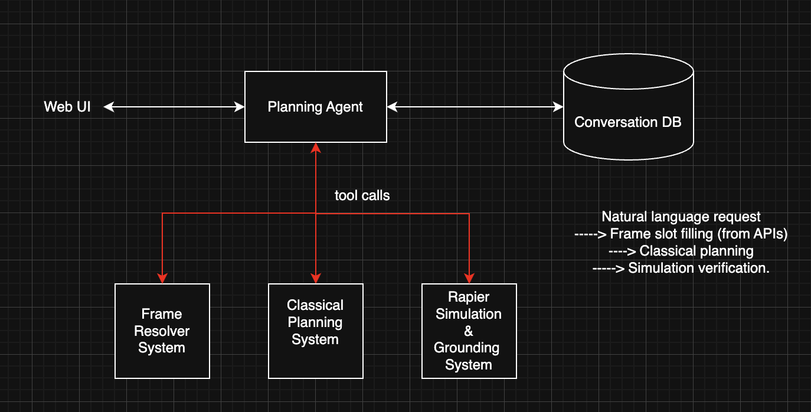

# Defunct: Development Continues in [Thoth](https://github.com/yashrahmed/Thoth)

# Planning with LLMs (TypeScript + Bun + Fastify)

This project explores frame-grounded hierarchical planning for end-to-end camping logistics using TypeScript.

## Stack

- Runtime and package manager: `Bun`
- Server framework: `Fastify`
- Language: `TypeScript`

## Database note

Use `Prisma` for DB connectivity when the persistence layer is added, but Prisma is intentionally **not installed** yet.

## Local Postgres

This repo now includes the same local Docker Postgres pattern used in `Thoth`:

1. Copy `db/local/.env.example` to `db/local/.env`.
2. Start Postgres plus run Flyway migrations:
   - `bun run db:local:launch`
3. Stop the local database:
   - `bun run db:local:stop`

The database uses the `pgvector` image and enables the `vector` extension during initialization.

## Quick start

1. Install dependencies:
   - `bun install`
2. Run dev server:
   - `bun run dev`
3. Health check:
   - `GET http://localhost:3000/health`

## Goal

Build an LLM-driven planner that can handle all core trip constraints:

1. Ingredients required for food preparation.
2. Driving to and from the campsite.
3. Residence addresses of people.
4. Breaks during the drive.
5. Car charging for EVs.
6. Recreational activities at the campsite.

## Architecture direction

Use a frame-grounded hierarchy:

1. Natural language intent.
2. Abstract concept frames.
3. Grounded frames from external knowledge bases.
4. Executable timeline plus simulation checks.

Reference summary: [Frame-Grounded-Hierarchical-Planning-Summary.docx](./Frame-Grounded-Hierarchical-Planning-Summary.docx)

